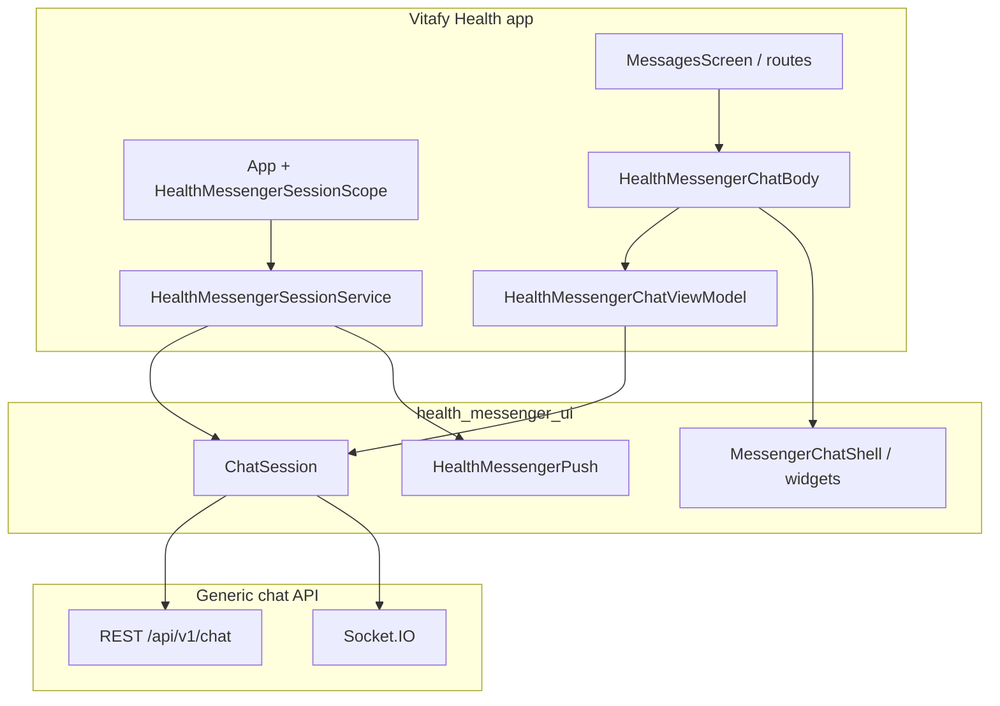

# Health Messenger UI — setup guide

This document covers local development of the **`health_messenger_ui`** Flutter package and how it is integrated into the **Vitafy Health** mobile app.

| Repo | Path |
|------|------|
| Chat package (this repo) | `chat_app_package` |
| Vitafy Health mobile app | `/Users/sujan/vitafy/vitafyhealth-mobile-app` |

The package name on pub is **`health_messenger_ui`**. Vitafy consumes it as a **path dependency** during feature work; production builds may later pin a git tag or published version.

---

## What this package provides

- **UI** (`package:health_messenger_ui/lib/health_messenger_ui.dart`): conversation list, thread, composer, presence scope, suggested people, themes.
- **Client** (`package:health_messenger_ui/lib/health_messenger_client.dart`): REST + Socket.IO chat client, `ChatSession`, inbox/delivery helpers, presence.
- **Push** (`package:health_messenger_ui/lib/health_messenger_push.dart`): native bridge + FCM foreground binding for delivered receipts.
- **Testing** (`package:health_messenger_ui/lib/health_messenger_client_testing.dart`): fakes for unit/widget tests.

Backend contract aligns with **vitafy-generic-chat** (same API key, tenant/user registration, socket `auth` shape as the web widget). See [README.md](README.md) for wire-format notes and parity checklist references.

---

## Prerequisites

- Flutter **≥ 3.22**, Dart **≥ 3.5** (see [pubspec.yaml](pubspec.yaml)).
- Access to a generic-chat API deployment (API base URL, socket origin, widget access key).
- For push in app or example: Firebase project with `google-services.json` (Android) and `GoogleService-Info.plist` (iOS).

---

## Run the package example app

The `example/` app is the fastest way to validate backend connectivity without Vitafy.

```bash
cd example
flutter pub get
flutter run
```

1. Fill in API base URL, socket URL, API key, and external identity fields on the configuration screen (same fields Vitafy derives automatically — see below).
2. Open chat; optional Firebase setup is described in [example/README.md](example/README.md).

**Package tests:**

```bash
flutter test
```

---

## Link the package into Vitafy Health

### 1. Path dependency

In Vitafy `pubspec.yaml`:

```yaml
dependencies:
  health_messenger_ui:
    path: "/absolute/path/to/chat_app_package"
```

Use the real path on your machine (Vitafy currently points at the Desktop `chat_app_package` checkout). After changing the path or package API:

```bash
cd /Users/sujan/vitafy/vitafyhealth-mobile-app
flutter pub get
```

### 2. Environment variables

Vitafy loads `.env` / flavor files via `flutter_dotenv`. Chat reads the same keys as the **web widget**, with optional mobile-specific overrides.

| Purpose | Preferred (mobile) | Fallback (web widget) |
|---------|-------------------|------------------------|
| REST API origin | `HEALTH_MESSENGER_API_BASE_URL` | `VITE_API_URL` |
| Socket origin (no `/api` path) | `HEALTH_MESSENGER_SOCKET_URL` | `VITE_SOCKET_URL` |
| API key (`accessKey:secret`) | `HEALTH_MESSENGER_API_KEY` | `VITE_WIDGET_ACCESS_KEY` |

Copy from `.env.sample` in the Vitafy repo and set values per flavor (`.env.dev`, `.env.qa`, `.env.uat`, `.env.prod`). Do not commit real keys.

**Notes:**

- `VITE_API_URL` in Vitafy is typically the **host origin** (e.g. `https://api-generic-chat.vitafyhealth.com`), not a path suffix. The client uses `ChatServiceConfig.chatApiPath` (default `/api/v1/chat`) unless you override it.
- Socket URL must be the **socket server origin** only (no `/api` segment).

### 3. Compile-time flavor → tenant prefix

Vitafy prefixes `externalTenantId` with `DEV_`, `QA_`, `UAT_`, or `PROD_` from compile-time `FLAVOR` so tenants do not collide across environments. Run with:

```bash
flutter run --flavor dev --dart-define=FLAVOR=dev
```

See Vitafy `README.md` and `.vscode/launch.json` for qa/uat/prod variants. Mapping lives in `HealthMessengerBootstrapConfig` in the Vitafy app.

---

## Vitafy integration architecture

Vitafy wraps the package in a thin host layer under `lib/feature/messages/`. The host owns Vitafy APIs (associated users, cases); the package owns chat UI and transport.



### Key Vitafy files

| File | Role |
|------|------|
| `lib/feature/messages/health_messenger/health_messenger_bootstrap_config.dart` | Builds bootstrap from `UserDetailModel` + dotenv |
| `lib/feature/messages/health_messenger/health_messenger_session_service.dart` | App-root `ChatSession`, bootstrap, push bridge |
| `lib/feature/messages/health_messenger/health_messenger_session_scope.dart` | Wraps app with `MessengerPresenceScope` when session exists |
| `lib/feature/messages/viewmodels/health_messenger_chat_viewmodel.dart` | UI state: conversations, messages, associated users → `MessengerUser` |
| `lib/feature/messages/widgets/health_messenger_chat_body.dart` | Embeds `MessengerChatShell` + Provider VM |
| `lib/feature/messages/screens/health_messenger_chat_screen.dart` | Full-screen chat route |
| `lib/feature/messages/health_messenger/associated_user_to_messenger_user.dart` | Maps Vitafy associated users to package models |
| `lib/di/service_locator.dart` | Registers `HealthMessengerSessionService` + `HealthMessengerChatViewModel` |
| `lib/app.dart` | Root `HealthMessengerSessionScope` around `MaterialApp.router` |

### Bootstrap identity mapping

`HealthMessengerBootstrapConfig.tryBuild(user)` maps Vitafy auth profile to `ChatSession.bootstrap` parameters:

| Package field | Vitafy source |
|---------------|---------------|
| `externalTenantId` | `user.tenantAssociation.tenantId` + flavor prefix |
| `externalUserId` | `user.userId` |
| `externalUserRole` | `tenantAssociation.userType` or first `roles` entry |
| `email` / display name | Profile fields on `UserDetailModel` |
| `profile` | `profilePicture` (optional) |

If `tryBuild` returns `null`, `describeValidationFailure` explains missing env or user fields (surfaced in session bootstrap errors).

### Session lifecycle

| Event | Vitafy call |
|-------|-------------|
| User lands on dashboard (authenticated) | `locator<HealthMessengerSessionService>().ensureStarted()` — idempotent bootstrap |
| Messages tab loads | `ensureStarted()` again (safe no-op if ready) |
| User opens chat UI | `HealthMessengerChatBody` creates `HealthMessengerChatViewModel`, attaches to existing session |
| Logout | `HealthMessengerSessionService.stopSession()` (profile logout) — disconnects socket, tears down push |

`HealthMessengerSessionService` holds one `ChatSession` per login, uses `PresenceConfig.backgroundOfflineGrace` (4 minutes), and optionally wires FCM after bootstrap when Firebase is initialized.

### UI entry points

- **Embedded**: `MessagesScreen` shows `HealthMessengerChatBody` in the messages tab (admin and client layouts).
- **Full screen**: `GoRoute` `RouteNames.healthMessengerChat` → `HealthMessengerChatScreen`.
- Navigation from conversation tiles / associated users / create-chat flows uses `context.push(RouteNames.healthMessengerChat)`.

`HealthMessengerChatBody` parameters:

- `shouldPopOnLogout` — pop route on logout (standalone screen).
- `popParentRouteAfterDeleteConversation` — defer `GoRouter.pop` after package closes mobile thread (standalone only).
- Delete confirmation is owned by the package thread header; the host runs delete API only.

### Dependency injection

Registered in `service_locator.dart`:

- `HealthMessengerSessionService` — lazy singleton (needs `DashboardViewModel` for user detail).
- `HealthMessengerChatViewModel` — factory per chat UI subtree.

---

## Push notifications (Vitafy + package)

After successful bootstrap, Vitafy mirrors the example app:

1. `HealthMessengerPush.instance.startListening()` + `syncNativePushConfig`.
2. `MessengerPushFirebaseBinding.attachForeground` for delivered ACK on foreground FCM.
3. `drainNativeAckQueue()` for native-stored events.

Requires Vitafy’s existing Firebase init (same as other FCM features). If Firebase is not initialized, chat still works; push bridge logs and skips.

**FCM data payload** (chat): string `type` = `CHAT_MESSAGE` (configurable), plus `messageId` / `conversationId` (snake_case aliases supported). See [example/README.md](example/README.md).

**iOS / Android native**: the package plugin (`HealthMessengerUiPlugin`) handles background delivery ACK; enable Push Notifications and Background Modes on iOS. Vitafy should already include Firebase plist/json for its main app — no separate Firebase app is required for the package alone.

---

## Associated users and directory

Vitafy loads **associated users** from its own REST API and resolves them to package `MessengerUser` / `TenantUser` via:

- `resolveTenantUserForAssociated` / `messengerUserFromAssociatedWithTenant`
- Fallback `decimalChatUserIdOnAssociatedRow` when chat user id is on the associated-user row but tenant user list is paginated

`HealthMessengerChatViewModel` feeds `MessengerSuggestedDirectoryScope` and conversation creation; keep chat user ids as **decimal chat user primary keys**, not Vitafy association UUIDs, when addressing participants.

---

## Parity and debugging

- Enable debug logging: Vitafy passes `apiLogger` / `SocketPrettyLogger` when `kDebugMode`.
- Compare REST bodies and socket handshake `auth` with the web widget against the same API key (DevTools Network vs Flutter logs).
- REST default prefix: `/api/v1/chat`; uploads: `/api/upload/file`. Override via `ChatServiceConfig` if your gateway differs.

---

## Troubleshooting

| Symptom | Check |
|---------|--------|
| “Missing VITE_API_URL…” | Dotenv not loaded for current flavor; verify `.env.*` and `flutter_dotenv` init |
| Bootstrap fails: tenant/user | Signed-in `UserDetailModel` must include tenant id, user id, email |
| Socket connects but no realtime | Firewall / wrong `VITE_SOCKET_URL`; try `socketTransports: ['websocket']` (Vitafy default) |
| Wrong tenant’s chats | `FLAVOR` dart-define missing → no `DEV_`/`QA_` prefix on `externalTenantId` |
| `flutter pub get` path error | `health_messenger_ui.path` in Vitafy `pubspec.yaml` must exist on disk |
| Push off | Firebase not initialized, missing platform config, or permission denied |
| Advisories decode warning on `pub get` | Known pub.dev noise; dependencies still resolve — see [example/README.md](example/README.md) |

---

## Related docs

- [README.md](README.md) — API usage snippets and transport notes
- [example/README.md](example/README.md) — example Firebase and push setup
- Vitafy: `lib/feature/messages/health_messenger/*`, `README.md` (run/build flavors)

When changing package APIs, run **`flutter test`** here and exercise Vitafy messages tab + `healthMessengerChat` route after **`flutter pub get`** in the mobile app.
